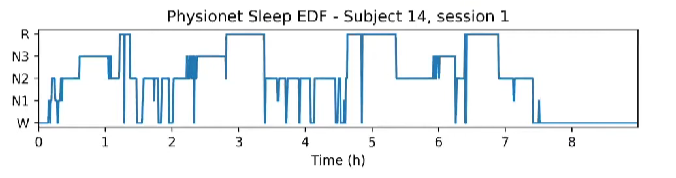
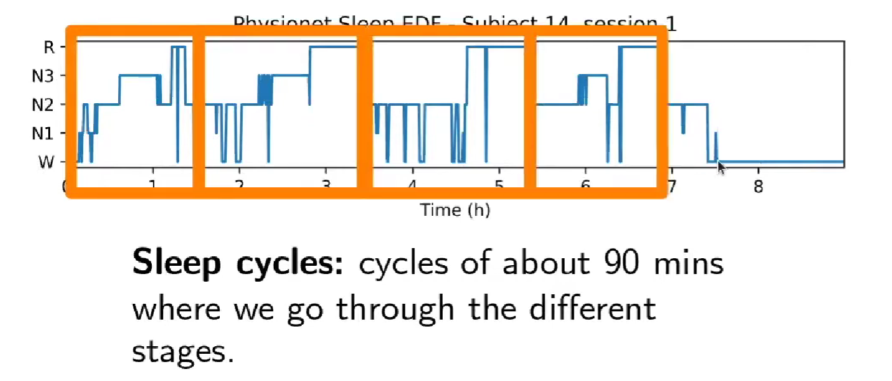
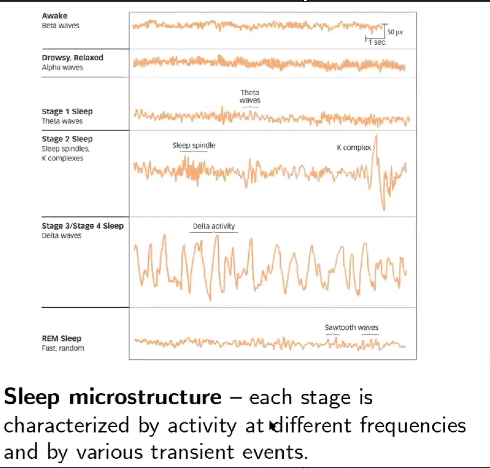
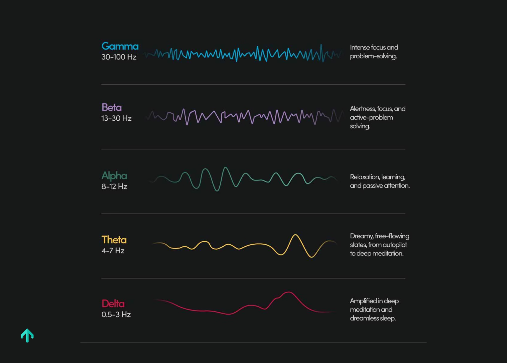
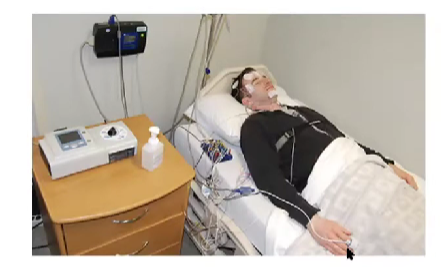
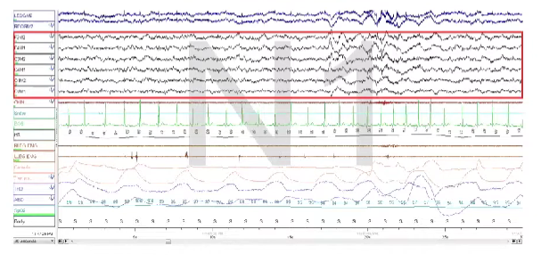
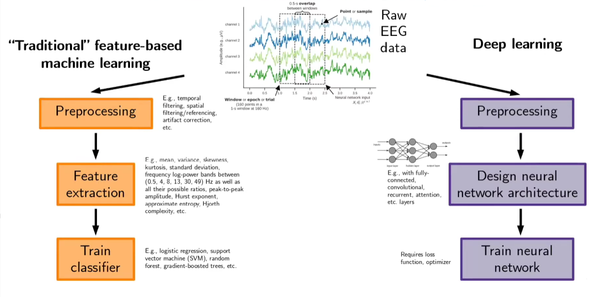
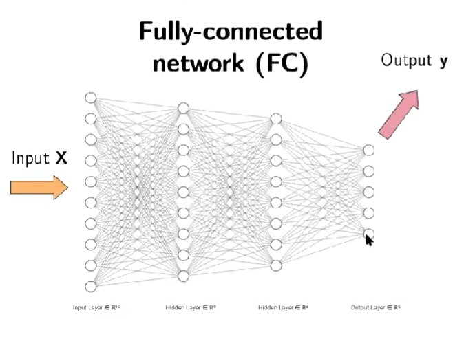
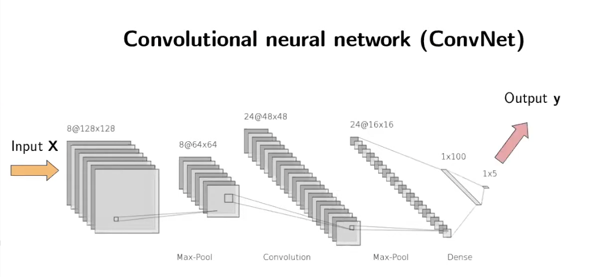
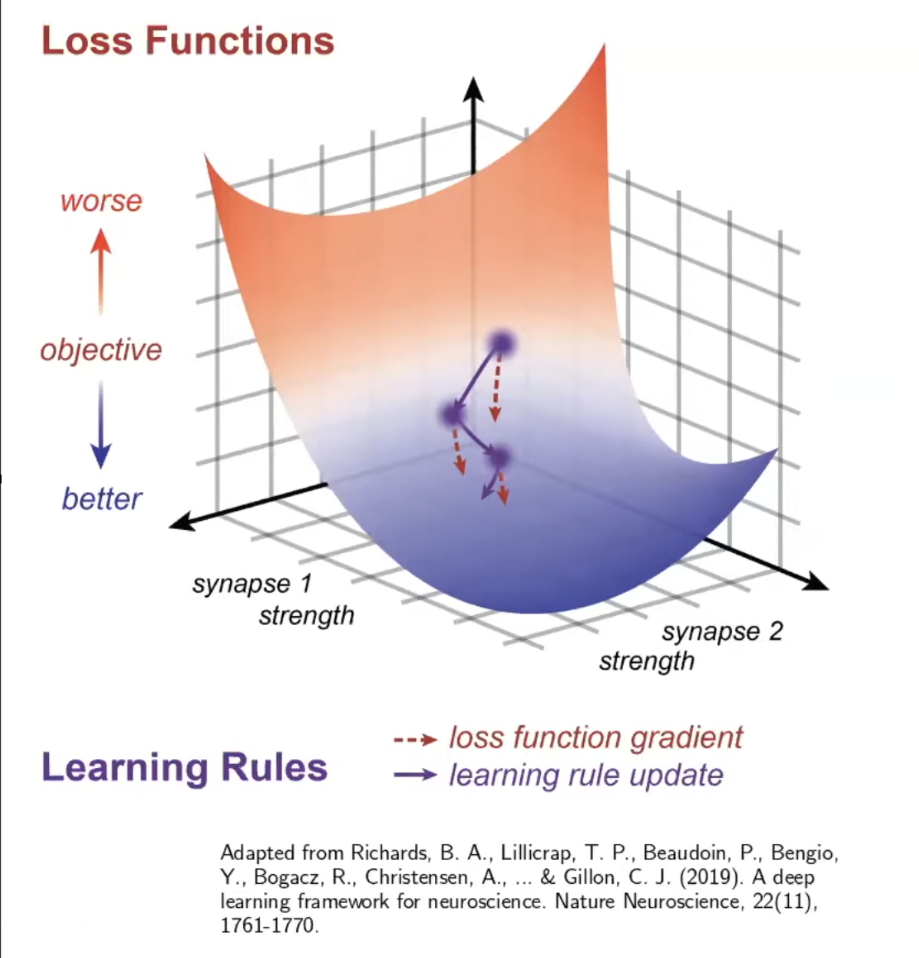

# Classify_EEG_Sleep_Stages-MNE-CNN
This repository documents my work following a tutorial on training a CNN model on raw EEG data to classify sleep stages by [Hubert Banville and Richard Höchenberger on BCBL](https://www.youtube.com/watch?v=nQD31jwhgng).

The original tutorial code is available in this [Github repo](https://github.com/hubertjb/dl-eeg-tutorial).

# Background
## Sleep Staging

During sleep, EEG recordings show distinct patterns and strong transient events. We typically divide these sleep events/stages into five Sleep Stages:

1. **Wake -** Being awake.

2. **N1 (*Non-REM sleep*) -** The lightest sleep stage, where it is very easy to wake up.

3. **N2 (*Non-REM sleep*) -** This stage is between light and deep sleep and is a phase of light-to-medium sleep.

4. **N3 (*Non-REM sleep*) -** During this stage you are in deep sleep and it is very hard to wake up.

5. **R (*REM Sleep*) -** This is where most of the dreaming occurs, and from the EEG perspective the recordings are very similar to awake EEG.

<div style="text-align: center;">

<br />
Source: <a href="https://youtu.be/nQD31jwhgng?list=PLSw2v7gKz4Pfp3yOGOm56TG5qsFF2sAyC&t=195">Tutorial on Deep Learning on Sleep Data by Hubert Banville and Richard Höchenberger (11/10/2020) - BCBL</a>
</div>
The hypnogram plot shows the sleep cycle structure during an 8-hour sleep period. Sleep cycles last approximately 90 minutes and repeat throughout the night, progressing from wake to light sleep to deep sleep and finally REM sleep. This cyclical pattern is known as sleep macrostructure.

In contrast, sleep microstructure refers to the characteristic frequencies and transient events within each stage. For example, Stage 2 (N2) features sleep spindles—oscillations at around 11-16 Hz—often followed by K-complexes, which are distinctive sharp slow waves.
  
<div style="text-align: center;">


<br />
Source: <a href="https://youtu.be/nQD31jwhgng?list=PLSw2v7gKz4Pfp3yOGOm56TG5qsFF2sAyC&t=217">Tutorial on Deep Learning on Sleep Data by Hubert Banville and Richard Höchenberger (11/10/2020) - BCBL</a> & <a href="https://www.macmillanhighered.com">Macmillan Higher Ed</a>
</div>

> **The Brain Bands:** <br />
> <div style="text-align: center;">
> 
> <br />
> Source: <a href="https://www.myndlift.com/post/what-are-brainwaves">myndlift</a>
> </div>
>
>   + **Delta (1-4 Hz):** Deep sleep, or very slow cognitive processes.
>   + **Theta (4-8 Hz):** Often related to *memory encoding/retrieval and cognitive control* (like doing a difficult math problem).
>   + **Alpha (8-12 Hz):** The most famous rhythm! It usually reflects *inhibition* (a feeling that makes one self-conscious and unable to act in a relaxed and natural way) or *idling* :
>       - *High Alpha:* Brain area is "shutting down" / resting (e.g., visual cortex when eyes are closed).
>       - *Low Alpha:* Brain area is active / processing.
>   + **Beta (12-30 Hz):** Associated with *motor control* (movement planning) and active concentration/alertness.
>   + **Gamma (>30 Hz):** High-level feature binding and conscious processing.


## Sleep Staging in the Clinic
In a clinical setting, we run a **polysomnogram** test for electrophysiological recordings (EEG, EOG, ECG, etc.) in a well-controlled environment (e.g., sleep clinic).

<div style="text-align: center;">

<br />
Source: <a href="https://youtu.be/nQD31jwhgng?list=PLSw2v7gKz4Pfp3yOGOm56TG5qsFF2sAyC&t=217">Tutorial on Deep Learning on Sleep Data by Hubert Banville and Richard Höchenberger (11/10/2020) - BCBL</a>
</div>

After recording an 8-hour sleep session, sleep experts must manually annotate the raw data — a very lengthy and time-consuming process. Once we have the sleep stage annotations, they can be used to break down the sleep stages for deeper analysis or to check for the presence of specific transient events that help diagnose sleep disorders (e.g., sleep apnea, insomnia).

<div style="text-align: center;">

<br />
Source: <a href="https://youtu.be/nQD31jwhgng?list=PLSw2v7gKz4Pfp3yOGOm56TG5qsFF2sAyC&t=217">Tutorial on Deep Learning on Sleep Data by Hubert Banville and Richard Höchenberger (11/10/2020) - BCBL</a>
</div>

## Automated Sleep Staging
We can use machine learning techniques to automate sleep staging and save time.

### Traditional Feature-Based Machine Leearning
Starting from raw EEG data and based on expert knowledge, we initially extract features that help describe the sleep stages. A machine learning classifier can then be trained to understand the different sleep stage patterns and predict them on unseen recordings. However, to extract meaningful features in the first place, we also need to perform some preprocessing to clean the data.

### Deep Learning
On the other hand, instead of spending time and effort on feature extraction for traditional feature-based ML, we can choose the route of deep learning (DL). In DL, we don't have to worry about feature extraction. Instead, the chosen neural network architecture (multi-layer perceptron (MLP) / Fully-connected network (FC), convolutional neural network (CNN / ConvNet), etc.) will learn the best features to describe the different sleep stages and classify them accordingly.

<div style="text-align: center;">

<br />
Source: <a href="https://youtu.be/nQD31jwhgng?list=PLSw2v7gKz4Pfp3yOGOm56TG5qsFF2sAyC&t=217">Tutorial on Deep Learning on Sleep Data by Hubert Banville and Richard Höchenberger (11/10/2020) - BCBL</a>
</div>

> In both cases, we end up with a function that maps a raw EEG window (e.g., 30 seconds) to a sleep stage. The key difference is that traditional feature-based ML is more interpretable - since we design the features, we understand what the classifier is doing. However, this comes at the cost of extensive engineering effort. In contrast, DL is more of a black box where you tune hyperparameters to discover the optimal features automatically.

## Deep Learning Concepts
There are three main components to deep learning: **architecture**, **loss function**, and **optimiser**.

### **1. Architecture**
In simple terms, an **architecture** specifies the space of functions that can be modelled by our deep learning network (e.g., fully connected network (FC/MLP), convolutional neural network (CNN/ConvNet), recurrent networks, attention layers, etc.).

For simplicity, let's examine two architectures using an example input **X** of shape (4 × 3000) - a 30-second window of 4-channel EEG at 100 Hz:

#### **Fully Connected (Multi-Layer Perceptron) Network (FC/MLP)**
A FC/MLP consists of multiple layers with neurons/units. The first layer is the input layer, the last is the output layer, and everything in between comprises hidden layers. Every neuron in one layer connects to every neuron in the next layer.

Given our input (4 × 3000), it first gets flattened into a single vector of size 12,000, which is passed to the input layer. Each neuron in the next layer computes a weighted sum of all input neurons, applies a non-linear activation function, and passes the output forward. This process continues until reaching the output layer, where we have five neurons (one per sleep stage) producing probabilities that sum to 1.

<div style="text-align: center;">

<br />
Source: <a href="https://youtu.be/nQD31jwhgng?list=PLSw2v7gKz4Pfp3yOGOm56TG5qsFF2sAyC&t=599">Tutorial on Deep Learning on Sleep Data by Hubert Banville and Richard Höchenberger (11/10/2020) - BCBL</a>
</div>

#### **Convolutional neural networks (CNN/ConvNet)**
CNN use **convolutional kernels** (not just weights) combined with non-linear activation functions to extract lower-dimensional features (latent representations) from the input. This approach dramatically reduces the number of trainable parameters while providing **translation invariance** - the network produces the same output regardless of where a pattern appears in the input.

For example, whether a sleep spindle appears at the beginning or end of the 30-second window, the CNN will still detect it and classify the input as N2 sleep stage. 
> **Key insight**: Convolution enables weight sharing and translation invariance.

<div style="text-align: center;">

<br />
Source: <a href="https://youtu.be/nQD31jwhgng?list=PLSw2v7gKz4Pfp3yOGOm56TG5qsFF2sAyC&t=692">Tutorial on Deep Learning on Sleep Data by Hubert Banville and Richard Höchenberger (11/10/2020) - BCBL</a>
</div>

### **2. Loss Function**
A **loss function** measures how well the deep learning network performs its task. It quantifies the difference between the model's predictions and the true labels. Common loss functions include mean squared error (MSE), categorical cross-entropy, and triplet loss.

#### **Mean Squared Error (MSE) - For Regression Tasks**
When predicting continuous values (e.g., temperature, age, signal amplitude), we use MSE. It calculates the average squared difference between predicted and true values:

```math
MSE = \frac{1}{m} \sum_{i=1}^m ||\hat{y}^{(i)} - y^{(i)}||^2
```

where:
- $m$ = number of training samples
- $\hat{y}^{(i)}$ = predicted value for sample $i$
- $y^{(i)}$ = true value for sample $i$

> **Why squaring?** Squaring penalises larger errors more heavily than smaller ones. For example, an error of 2 contributes 4 to the loss, whilst an error of 4 contributes 16 - encouraging the model to prioritise fixing big mistakes.
>
> **Goal:** Minimise MSE during training so predictions get closer to true values.


#### **Categorical Cross-Entropy - For Multi-Class Classification**
For sleep staging, we have 5 classes (Wake, N1, N2, N3, REM). Cross-entropy measures how different the predicted probability distribution is from the true distribution:

```math 
CrossEntropy = -\sum_{i=1}^{m}\sum_{j=1}^{c} y_{j}^{(i)} \log(\hat{y}_{j}^{(i)}) 
```


where:
- $m$ = number of training samples
- $c$ = number of classes (5 for sleep stages)
- $y_{j}^{(i)}$ = true probability for class $j$ in sample $i$ (1 if correct class, 0 otherwise)
- $\hat{y}_{j}^{(i)}$ = predicted probability for class $j$ in sample $i$

> **Why the logarithm?** The $\log$ function creates an asymmetric penalty:
>   - If the model predicts the correct class with high confidence ($\hat{y} \approx 1$), then $\log(1) = 0$ → low loss ✓
>   - If the model predicts the correct class with low confidence ($\hat{y} \approx 0$), then $\log(0) \rightarrow -\infty$ → massive loss ✗
>
> This severe penalty when the model is confidently wrong forces it to learn faster from serious mistakes. For example, if the true label is N2 but the model predicts only 1% probability for N2, the loss will be very high, pushing the model to correct this error quickly.
>
> **Goal:** Minimise cross-entropy so the predicted probabilities match the true class labels.


### **3. Learning Rule / Optimiser**
The **optimiser** (or learning rule) connects the architecture and loss function by determining how to adjust the network's weights to minimise the loss. This is typically done using **gradient descent** and **backpropagation**.

#### **The Big Picture: How Neural Networks Learn**

Imagine you're lost in a foggy mountain valley trying to reach the lowest point (minimum loss). You can't see the whole landscape, but you can feel which direction slopes downward. Gradient descent works exactly like this - taking small steps in the direction that reduces the loss most steeply.

#### **What Are Gradients?**

A **gradient** is the mathematical way of describing "which direction makes things worse or better." Specifically, it tells us:
- **Direction**: Should we increase or decrease each weight?
- **Magnitude**: How much does each weight affect the loss?

For each weight in the network, the gradient answers: "If I nudge this weight slightly, does the loss go up or down, and by how much?"


#### **Backpropagation: Computing Gradients Efficiently**

**Backpropagation** (short for "backward propagation of errors") is the algorithm that calculates these gradients for every single weight in the network. Here's how it works:

1. **Forward pass**: Input data flows through the network layer by layer until we get a prediction and calculate the loss.

2. **Backward pass**: Starting from the output layer, we work backwards through the network using the **chain rule** from calculus. The chain rule lets us break down how each weight contributed to the final loss by multiplying **derivatives** layer by layer.

3. **Gradient calculation**: For each weight, we compute how sensitive the loss is to changes in that weight. This gives us the gradient.

**Why "back" propagation?** Because we start at the end (output layer) and propagate the error signal backwards through each layer to figure out how much each weight is responsible for the mistake.

> **Derivatives and Gradients** <br />
> To understand how we find this direction, we need calculus.
>
>   1. *The Derivative (The Slope)* <br />
>   Mathematically, the relationship between a weight ($w$) and the loss ($L$) is defined by the derivative $\frac{\partial L}{\partial w}$.
>       - It represents the slope of the loss function with respect to that specific weight.
>       - It answers: "If I increase this weight $w$ by a tiny amount $\epsilon$, how much does the Loss $L$ change?"
>
>   2. *The Gradient Vector* <br />
>   A neural network has thousands of weights ($w_1, w_2, ... w_n$). The gradient ($\nabla L$) is simply a vector collecting the partial derivatives for every single weight: $$\nabla L = [{{\partial L} \over {\partial w_1}}, {{\partial L} \over {\partial w_2}}, ...., {{\partial L} \over {\partial w_n}}]$$ 
This vector points in the direction of the steepest increase in loss. To decrease loss, we move in the opposite direction (negative gradient).
>
> **Backpropagation: The Chain Rule in Action** <br />
> How do we calculate $\frac{\partial L}{\partial w}$ for a weight deep inside the network? We use the Chain Rule.
>
> The Chain Rule states that if variable $L$ depends on $y$, and $y$ depends on $x$, then: $${{{\partial L}\over{\partial x}} = {{\partial L}\over{\partial y}}.{{\partial y}\over{\partial x}}}$$
> - *A Concrete Examples:* <br />
>   + Imagine a single neuron with one weight $w$, one input $x$, and a target $y$.
>      1. Prediction: $\hat{y} = w \cdot x$
>      2. Loss (MSE): $L = (\hat{y} - y)^2$
>
>       To update $w$, we need the gradient $\frac{\partial L}{\partial w}$. We apply the chain rule:
>       + *Step A: Calculate derivate of Loss w.r.t Prediction ( $\frac{\partial L}{\partial \hat{y}}$ )*: $$L = {(\hat{y} - y)^2} \rarr {\partial L \over \partial y} = 2(\hat{y} - y)$$
This is the "error" term.
>       + *Step B: Calculate derivative of Prediction w.r.t Weight ( $\frac{\partial \hat{y}}{\partial w}$ ):* $$\hat{y} = w . x \rarr {\partial \hat{y} \over \partial w} = x$$
This is the "input" term.
>       + *Step C: Combine them:* $${\partial L \over \partial w} = {2(\hat{y} - y)} . x$$
This is the chain rule!
>
>       This result tells us exactly how to update the weight: the adjustment depends on the magnitude of the error $(\hat{y} - y)$ multiplied by the input strength $x$. Backpropagation is just applying this chain rule recursively from the last layer back to the first.
>   + Let's say we have a 2-Layer Network: 
>       ```
>           Input → Layer 1 (w₁) → Layer 2 (w₂) → Output → Loss
>       ```
>       +   The gradient for w₁ (deep in the network) is: $${\partial L \over \partial w_1} = {\partial L \over \partial \hat{y}} . {\partial \hat{y} \over \partial z_2} . {\partial z_2 \over \partial z_1} . {\partial z_1 \over \partial w_1}$$
>       +   The gradient for w2 (near the output layer)  is: $${\partial L \over \partial w_2} = {\partial L \over \partial \hat{y}} . {\partial \hat{y} \over \partial z_2} . {\partial z_2 \over \partial w_2}$$
>
>   We can see using chain rule — each layer tells us "how much it passed the error backward."


#### **Gradient Descent: Using Gradients to Update Weights**

Once we have gradients for all weights, **gradient descent** updates them to reduce the loss:

$$ w_{new} = w_{old} - \eta \cdot \frac{\partial L}{\partial w} $$

where:
- $w$ = a weight in the network
- $\eta$ (eta) = **learning rate** (step size)
- $\frac{\partial L}{\partial w}$ = gradient of the loss with respect to that weight

**The intuition:**
- If the gradient is **positive** ($\frac{\partial L}{\partial w} > 0$), increasing the weight increases the loss → so we **decrease** the weight (subtract)
- If the gradient is **negative** ($\frac{\partial L}{\partial w} < 0$), increasing the weight decreases the loss → so we **increase** the weight (subtracting a negative = adding)

#### **The Learning Rate: Controlling Step Size**

The **learning rate** ($\eta$) controls how big a step we take in the direction of the gradient:

- **Too large**: We might overshoot the minimum and bounce around wildly, never converging
- **Too small**: Learning will be very slow, requiring many iterations
- **Just right**: We make steady progress towards the minimum

Think of it like adjusting your stride length when descending a mountain - too big and you might tumble, too small and it takes forever.


#### **Stochastic Gradient Descent (SGD)**

In practice, we use **Stochastic Gradient Descent**, which updates weights using small random subsets (mini-batches) of training data rather than the entire dataset. This:
- Speeds up training significantly
- Adds useful randomness that helps escape local minima
- Allows training on datasets too large to fit in memory


> **Modern Optimisers** <br />
Basic SGD has been improved with various techniques:
>   + **SGD + Momentum**: Adds "velocity" to weight updates, helping push through small bumps in the loss landscape
>   + **Adam**: Adapts the learning rate for each weight individually based on recent gradient history
>   + **RMSProp**: Scales learning rates based on recent gradient magnitudes
>   + **Adagrad**: Adjusts learning rates based on how frequently weights are updated
>
> These optimisers are conveniently implemented in frameworks like **PyTorch** and **TensorFlow**, which handle all the gradient calculations automatically through **automatic differentiation** (autodiff).

<div style="text-align: center;">

<br />
Source: <a href="https://youtu.be/nQD31jwhgng?list=PLSw2v7gKz4Pfp3yOGOm56TG5qsFF2sAyC&t=836">Tutorial on Deep Learning on Sleep Data by Hubert Banville and Richard Höchenberger (11/10/2020) - BCBL</a>
</div>

> **The Training Loop in Summary**
>
>   1. **Forward pass**: Feed input through the network → get prediction → calculate loss
>   2. **Backpropagation**: Calculate gradients for all weights
>   3. **Gradient descent**: Update weights using gradients and learning rate
>   4. **Repeat**: Continue for many iterations (epochs) until loss converges
>
>This iterative process is how neural networks "learn" the optimal weights to minimise the loss function and accurately classify sleep stages.**

# Setup
We will setup a python virtual environment (venv) for this project:

```bash
# 1. Create the venv
python3 -m venv .venv

# 2. Activate the venv
source .venv/bin/activate

# 3. Install dependencies
pip install -r reqs.txt
```

Let's now check whether a CUDA-enabled GPU is available for the `torch` lib in our venv:
```bash
# 1. Activate the venv
source .venv/bin/activate

# 2. Torch CUDA check
python3 -c "import torch; print('CUDA-enabled GPU found. Training should be faster.') if torch.cuda.is_available() else print('No GPU found. Training will be carried out on CPU, which might be slower.\n\nIf running on Google Colab, you can request a GPU runtime by clicking \"Runtime/Change runtime type\" in the top bar menu, then selecting \"GPU\" under \"Hardware accelerator\".')"
```

To make sure MNE-Python was installed correctly, type the following command in a terminal:
```bash
# 1. Activate the venv
source .venv/bin/activate

# 2. display mne setup system information
python -c "import mne; mne.sys_info()"
```

This should display some system information along with the versions of MNE-Python and its dependencies. Typical output looks like this:

```bash
Platform                Windows-10-10.0.20348-SP0
Python                  3.10.12 | packaged by conda-forge | (main, Jun 23 2023, 22:34:57) [MSC v.1936 64 bit (AMD64)]
Executable              C:\Miniconda3\envs\mne\python.exe
CPU                     Intel64 Family 6 Model 85 Stepping 7, GenuineIntel (2 cores)
Memory                  7.0 GB

Core
├☑ mne                  1.6.0.dev67+gb12384562
├☑ numpy                1.25.2 (OpenBLAS 0.3.23.dev with 1 thread)
├☑ scipy                1.11.2
├☑ matplotlib           3.7.2 (backend=QtAgg)
├☑ pooch                1.7.0
└☑ jinja2               3.1.2

Numerical (optional)
├☑ sklearn              1.3.0
├☑ nibabel              5.1.0
├☑ nilearn              0.10.1
├☑ dipy                 1.7.0
├☑ openmeeg             2.5.6
├☑ pandas               2.1.0
└☐ unavailable          numba, cupy

Visualization (optional)
├☑ pyvista              0.41.1 (OpenGL 3.3 (Core Profile) Mesa 10.2.4 (git-d92815a) via Gallium 0.4 on llvmpipe (LLVM 3.4, 256 bits))
├☑ pyvistaqt            0.0.0
├☑ ipyvtklink           0.2.2
├☑ vtk                  9.2.6
├☑ qtpy                 2.4.0 (PyQt5=5.15.8)
├☑ ipympl               0.9.3
├☑ pyqtgraph            0.13.3
└☑ mne-qt-browser       0.5.2

Ecosystem (optional)
└☐ unavailable          mne-bids, mne-nirs, mne-features, mne-connectivity, mne-icalabel, mne-bids-pipeline
```

Lastly, make sure to select the kernel with name `.venv (<python verion>) (Python <python verion>)` when running the [jupyter notebook](./sleep_staging.ipynb). 

## Project Structure
```bash
.
├── README.md
├── imgs                    # Screenshots and visualizations for the README
├── reqs.txt                # Python dependencies
├── sleep_staging.ipynb     # Main entry point: Data exploration & model training
└── src                     # Core logic and source code
    ├── models              # Model architectures and classes
    │   └── __init__.py
    └── utils               # Helper functions scripts
        ├── __init__.py
        └── data_loader.py  # Data processing and loading script
```

# Update Logs

## 19th of Feb, 2026

> ### 11:57 pm (IST)
> #### New:
>   + Added [datasets](/src/datasets/) src dir.
>       - Created [epochs.py](/src/datasets/epochs.py) which contains the `EpochsDataset` class and initialised [__init__.py](/src/datasets/__init__.py) for the defined module.
>   + Added [preprocessing.py] module to [utils](./src/utils/) src dir.

> #### Updates:
>   + Updated [data_loader.py](/src/utils/data_loader.py) Docstring.
>   + Updated [__init__.py] from [utils](/src/utils/) Docstring and added the new module.
>   + Updated [sleep_staging.ipynb](./sleep_staging.ipynb) with new Epochs section. 
>   + Updated [README.md](./README.md).

## 18th of Feb, 2026

> ### 11:58 pm (IST)
> #### Updates:
>   + Fixed the tmax crop error in [data_loader.py](./src/utils/data_loader.py) module's `load_sleep_physionet_raw_data()` function.
>   + Updated the data loading section code in [sleep_staging.ipynb](./sleep_staging.ipynb). 
>   + Updated [README.md](./README.md).

## 16th of Feb, 2026

> ### 11:34 pm (IST)
> #### New:
>   + Added [sleep_staging.ipynb](./sleep_staging.ipynb), which is the main entry point, and currently contains the data loading section.
>   + Added [reqs.txt](./reqs.txt) - Python dependencies
>   + Added [src](./src) dir - which contains Core logic and source code
>        - Added [utils](./src/utils/) dir with 
        [\_\_init\_\_.py](./src/utils/__init__.py) and [data_loader.py](./src/utils/data_loader.py) modules.
>
> #### Updates:
>   + Updated [README.md](./README.md).
>   + Updated [.gitignore](./.gitignore) - to ignore the `/data` dir.


## 13th of Feb, 2026

> ### 11:21 pm (IST)
> #### New:
>   + Added [imgs](./imgs) dir - which at the moment contains images used in the [README.md](./README.md) file.
>
> #### Updates:
>   + Updated [README.md](./README.md).


