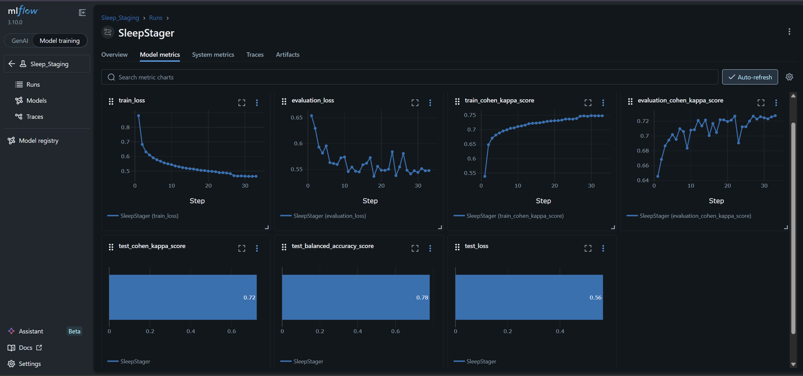
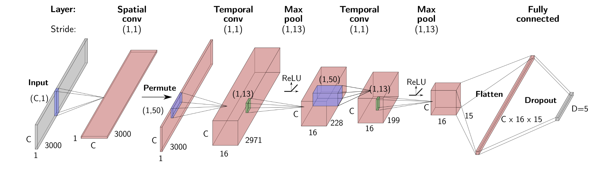

# Automated Sleep Stage Classification from Raw EEG using a CNN

**Classifying 30-second EEG epochs into 5 sleep stages (W, N1, N2, N3, R) using a spatial-temporal Convolutional Neural Network.**

This project trains a lightweight CNN on raw multi-channel EEG and EOG data from the [PhysioNet Sleep EDF Expanded](https://physionet.org/content/sleep-edfx/) dataset. The model learns to classify 30-second windows into five sleep stages, matching the modern [AASM](https://aasm.org/) clinical standard, without any manual feature engineering.

| | |
|---|---|
| **Architecture** | [SleepStager](src/models/sleep_stager.py) — a spatial-temporal ConvNet ([Chambon et al., 2018](https://doi.org/10.1109/TNSRE.2018.2813138) variant), modified with LeakyReLU and Batch Normalisation |
| **Dataset** | [SleepEDF-78](https://physionet.org/content/sleep-edfx/1.0.0/sleep-cassette/#files-panel) — 78 subjects, 153 recordings, 3 channels (2 EEG + 1 EOG) at 100 Hz |
| **Pipeline** | Raw EDF → Band-pass filter (0.5–30 Hz) → ICA artifact removal → 30s epoch extraction → Per-epoch z-score → Subject-wise split → Train CNN |
| **Config** | All hyperparameters in [`config.yaml`](config.yaml) |
| **Notebook** | Full walkthrough in [`sleep_staging.ipynb`](sleep_staging.ipynb) |


## Results

On a held-out test set (20% of subjects, never seen during training or validation):

| Metric | Score |
|---|---|
| **Cohen's Kappa** | ~0.72 |
| **Balanced Accuracy** | ~0.78 |
| **Test Loss** | ~0.56 |

<div style="text-align: center;" align="center">

<br />
<em>MLflow dashboard showing training/evaluation loss, Cohen's Kappa progression, and final test metrics.</em>
<br />
<br />
</div>

**Interpretation:** A Cohen's Kappa of 0.72 indicates *substantial agreement* between the model's predictions and expert annotations (0.61–0.80 is considered "substantial" on the Landis & Koch scale). This is achieved with a lightweight model trained on only 2 EEG + 1 EOG channels — competitive with much larger architectures. The balanced accuracy of 0.78 confirms the model performs reasonably across all five classes, not just the dominant N2 stage.

> **Note:** These results were obtained with the hyperparameters in [`config.yaml`](config.yaml). The [Design Decisions](#design-decisions--hyperparameter-choices) section below explains why each value was chosen.


## Table of Contents

- [Background](#background)
  - [Sleep Staging](#sleep-staging)
  - [Sleep Staging in the Clinic](#sleep-staging-in-the-clinic)
  - [Automated Sleep Staging](#automated-sleep-staging)
- [Deep Learning Primer](#deep-learning-primer)
  - [Architecture](#1-architecture)
  - [Loss Function](#2-loss-function)
  - [Optimiser](#3-learning-rule--optimiser)
- [Pipeline Overview](#pipeline-overview)
  - [Dataset](#dataset)
  - [Preprocessing](#preprocessing)
  - [Data Splitting](#data-splitting)
  - [Model Architecture](#model-architecture)
  - [Training](#training)
  - [Evaluation Metrics](#evaluation-metrics)
- [Design Decisions & Hyperparameter Choices](#design-decisions--hyperparameter-choices)
- [Project Structure](#project-structure)
- [Setup](#setup)
- [Acknowledgments](#acknowledgments)

---

# Background

## Sleep Staging

During sleep, EEG recordings show distinct patterns and strong transient events. We typically divide these sleep events/stages into five Sleep Stages:

1. **Wake (W)** — Being awake.

2. **N1 (*Non-REM sleep*)** — The lightest sleep stage, where it is very easy to wake up.

3. **N2 (*Non-REM sleep*)** — This stage is between light and deep sleep and is a phase of light-to-medium sleep.

4. **N3 (*Non-REM sleep*)** — During this stage you are in deep sleep and it is very hard to wake up.

5. **R (*REM Sleep*)** — This is where most of the dreaming occurs, and from the EEG perspective the recordings are very similar to awake EEG.

<div style="text-align: center;" align="center">

<br />
Source: <a href="https://youtu.be/nQD31jwhgng?list=PLSw2v7gKz4Pfp3yOGOm56TG5qsFF2sAyC&t=195">Banville & Höchenberger (2020) — BCBL</a>
<br />
<br />
</div>

The hypnogram plot shows the sleep cycle structure during an 8-hour sleep period. Sleep cycles last approximately 90 minutes and repeat throughout the night, progressing from wake to light sleep to deep sleep and finally REM sleep. This cyclical pattern is known as **sleep macrostructure**.

In contrast, **sleep microstructure** refers to the characteristic frequencies and transient events within each stage. For example, Stage N2 features **sleep spindles** — oscillations at around 11–16 Hz — often followed by **K-complexes**, which are distinctive sharp slow waves.

<div style="text-align: center;" align="center">


<br />
Source: <a href="https://youtu.be/nQD31jwhgng?list=PLSw2v7gKz4Pfp3yOGOm56TG5qsFF2sAyC&t=217">Banville & Höchenberger (2020) — BCBL</a> & <a href="https://www.macmillanhighered.com">Macmillan Higher Ed</a>
<br />
<br />
</div>

> **The Brain Bands** <br />
> <div style="text-align: center;" align="center">
> 
> <br />
> Source: <a href="https://www.myndlift.com/post/what-are-brainwaves">myndlift</a>
> <br />
> <br />
> </div>
>
>   + **Delta (1–4 Hz):** Deep sleep, or very slow cognitive processes.
>   + **Theta (4–8 Hz):** Often related to *memory encoding/retrieval and cognitive control* (like doing a difficult math problem).
>   + **Alpha (8–12 Hz):** The most famous rhythm! It usually reflects *inhibition* or *idling*:
>       - *High Alpha:* Brain area is "shutting down" / resting (e.g., visual cortex when eyes are closed).
>       - *Low Alpha:* Brain area is active / processing.
>   + **Beta (12–30 Hz):** Associated with *motor control* (movement planning) and active concentration/alertness.
>   + **Gamma (>30 Hz):** High-level feature binding and conscious processing.


## Sleep Staging in the Clinic

In a clinical setting, we run a **polysomnogram** test for electrophysiological recordings (EEG, EOG, ECG, etc.) in a well-controlled environment (e.g., sleep clinic).

<div style="text-align: center;" align="center">

<br />
Source: <a href="https://youtu.be/nQD31jwhgng?list=PLSw2v7gKz4Pfp3yOGOm56TG5qsFF2sAyC&t=217">Banville & Höchenberger (2020) — BCBL</a>
<br />
<br />
</div>

After recording an 8-hour sleep session, sleep experts must manually annotate the raw data — a very lengthy and time-consuming process. Once we have the sleep stage annotations, they can be used to break down the sleep stages for deeper analysis or to check for the presence of specific transient events that help diagnose sleep disorders (e.g., sleep apnea, insomnia).

<div style="text-align: center;" align="center">

<br />
Source: <a href="https://youtu.be/nQD31jwhgng?list=PLSw2v7gKz4Pfp3yOGOm56TG5qsFF2sAyC&t=217">Banville & Höchenberger (2020) — BCBL</a>
<br />
<br />
</div>


## Automated Sleep Staging

We can use machine learning techniques to automate sleep staging and save time.

### Traditional Feature-Based Machine Learning
Starting from raw EEG data and based on expert knowledge, we initially extract features that help describe the sleep stages. A machine learning classifier can then be trained to understand the different sleep stage patterns and predict them on unseen recordings. However, to extract meaningful features in the first place, we also need to perform some preprocessing to clean the data.

### Deep Learning
On the other hand, instead of spending time and effort on feature extraction for traditional feature-based ML, we can choose the route of deep learning (DL). In DL, we don't have to worry about feature extraction. Instead, the chosen neural network architecture (multi-layer perceptron (MLP) / Fully-connected network (FC), convolutional neural network (CNN / ConvNet), etc.) will learn the best features to describe the different sleep stages and classify them accordingly.

<div style="text-align: center;" align="center">

<br />
Source: <a href="https://youtu.be/nQD31jwhgng?list=PLSw2v7gKz4Pfp3yOGOm56TG5qsFF2sAyC&t=217">Banville & Höchenberger (2020) — BCBL</a>
<br />
<br />
</div>

> In both cases, we end up with a function that maps a raw EEG window (e.g., 30 seconds) to a sleep stage. The key difference is that traditional feature-based ML is more interpretable — since we design the features, we understand what the classifier is doing. However, this comes at the cost of extensive engineering effort. In contrast, DL is more of a black box where you tune hyperparameters to discover the optimal features automatically.

---

# Deep Learning Primer

There are three main components to deep learning: **architecture**, **loss function**, and **optimiser**.

## **1. Architecture**

In simple terms, an **architecture** specifies the space of functions that can be modelled by our deep learning network (e.g., fully connected network (FC/MLP), convolutional neural network (CNN/ConvNet), recurrent networks, attention layers, etc.).

For simplicity, let's examine two architectures using an example input **X** of shape (4 × 3000) — a 30-second window of 4-channel EEG at 100 Hz:

### **Fully Connected (Multi-Layer Perceptron) Network (FC/MLP)**
A FC/MLP consists of multiple layers with neurons/units. The first layer is the input layer, the last is the output layer, and everything in between comprises hidden layers. Every neuron in one layer connects to every neuron in the next layer.

Given our input (4 × 3000), it first gets flattened into a single vector of size 12,000, which is passed to the input layer. Each neuron in the next layer computes a weighted sum of all input neurons, applies a non-linear activation function, and passes the output forward. This process continues until reaching the output layer, where we have five neurons (one per sleep stage) producing probabilities that sum to 1.

<div style="text-align: center;" align="center">

<br />
Source: <a href="https://youtu.be/nQD31jwhgng?list=PLSw2v7gKz4Pfp3yOGOm56TG5qsFF2sAyC&t=599">Banville & Höchenberger (2020) — BCBL</a>
<br />
<br />
</div>

### **Convolutional Neural Networks (CNN/ConvNet)**
CNNs use **convolutional kernels** (not just weights) combined with non-linear activation functions to extract lower-dimensional features (latent representations) from the input. This approach dramatically reduces the number of trainable parameters while providing **translation invariance** — the network produces the same output regardless of where a pattern appears in the input.

For example, whether a sleep spindle appears at the beginning or end of the 30-second window, the CNN will still detect it and classify the input as N2 sleep stage.
> **Key insight**: Convolution enables weight sharing and translation invariance.

<div style="text-align: center;" align="center">

<br />
Source: <a href="https://youtu.be/nQD31jwhgng?list=PLSw2v7gKz4Pfp3yOGOm56TG5qsFF2sAyC&t=692">Banville & Höchenberger (2020) — BCBL</a>
<br />
<br />
</div>

## **2. Loss Function**
A **loss function** measures how well the deep learning network performs its task. It quantifies the difference between the model's predictions and the true labels. Common loss functions include mean squared error (MSE), categorical cross-entropy, and triplet loss.

### **Mean Squared Error (MSE) — For Regression Tasks**
When predicting continuous values (e.g., temperature, age, signal amplitude), we use MSE. It calculates the average squared difference between predicted and true values:

```math
MSE = \frac{1}{m} \sum_{i=1}^m ||\hat{y}^{(i)} - y^{(i)}||^2
```

where:
- $m$ = number of training samples
- $\hat{y}^{(i)}$ = predicted value for sample $i$
- $y^{(i)}$ = true value for sample $i$

> **Why squaring?** Squaring penalises larger errors more heavily than smaller ones. For example, an error of 2 contributes 4 to the loss, whilst an error of 4 contributes 16 — encouraging the model to prioritise fixing big mistakes.
>
> **Goal:** Minimise MSE during training so predictions get closer to true values.


### **Categorical Cross-Entropy — For Multi-Class Classification**
For sleep staging, we have 5 classes (Wake, N1, N2, N3, REM). Cross-entropy measures how different the predicted probability distribution is from the true distribution:

```math
CrossEntropy = -\sum_{i=1}^{m}\sum_{j=1}^{c} y_{j}^{(i)} \log(\hat{y}_{j}^{(i)})
```

where:
- $m$ = number of training samples
- $c$ = number of classes (5 for sleep stages)
- $y_{j}^{(i)}$ = true probability for class $j$ in sample $i$ (1 if correct class, 0 otherwise)
- $\hat{y}_{j}^{(i)}$ = predicted probability for class $j$ in sample $i$

> **Why the logarithm?** The $\log$ function creates an asymmetric penalty:
>   - If the model predicts the correct class with high confidence ($\hat{y} \approx 1$), then $\log(1) = 0$ → low loss
>   - If the model predicts the correct class with low confidence ($\hat{y} \approx 0$), then $\log(0) \rightarrow -\infty$ → massive loss
>
> This severe penalty when the model is confidently wrong forces it to learn faster from serious mistakes. For example, if the true label is N2 but the model predicts only 1% probability for N2, the loss will be very high, pushing the model to correct this error quickly.
>
> **Goal:** Minimise cross-entropy so the predicted probabilities match the true class labels.


## **3. Learning Rule / Optimiser**
The **optimiser** (or learning rule) connects the architecture and loss function by determining how to adjust the network's weights to minimise the loss. This is typically done using **gradient descent** and **backpropagation**.

### **The Big Picture: How Neural Networks Learn**

Imagine you're lost in a foggy mountain valley trying to reach the lowest point (minimum loss). You can't see the whole landscape, but you can feel which direction slopes downward. Gradient descent works exactly like this — taking small steps in the direction that reduces the loss most steeply.

### **What Are Gradients?**

A **gradient** is the mathematical way of describing "which direction makes things worse or better." Specifically, it tells us:
- **Direction**: Should we increase or decrease each weight?
- **Magnitude**: How much does each weight affect the loss?

For each weight in the network, the gradient answers: "If I nudge this weight slightly, does the loss go up or down, and by how much?"


### **Backpropagation: Computing Gradients Efficiently**

**Backpropagation** (short for "backward propagation of errors") is the algorithm that calculates these gradients for every single weight in the network. Here's how it works:

1. **Forward pass**: Input data flows through the network layer by layer until we get a prediction and calculate the loss.

2. **Backward pass**: Starting from the output layer, we work backwards through the network using the **chain rule** from calculus. The chain rule lets us break down how each weight contributed to the final loss by multiplying **derivatives** layer by layer.

3. **Gradient calculation**: For each weight, we compute how sensitive the loss is to changes in that weight. This gives us the gradient.

**Why "back" propagation?** Because we start at the end (output layer) and propagate the error signal backwards through each layer to figure out how much each weight is responsible for the mistake.

> **Derivatives and Gradients** <br />
> To understand how we find this direction, we need calculus.
>
>   1. *The Derivative (The Slope)* <br />
>   Mathematically, the relationship between a weight ($w$) and the loss ($L$) is defined by the derivative $\frac{\partial L}{\partial w}$.
>       - It represents the slope of the loss function with respect to that specific weight.
>       - It answers: "If I increase this weight $w$ by a tiny amount $\epsilon$, how much does the Loss $L$ change?"
>
>   2. *The Gradient Vector* <br />
>   A neural network has thousands of weights ($w_1, w_2, ... w_n$). The gradient ($\nabla L$) is simply a vector collecting the partial derivatives for every single weight: $$\nabla L = [{{\partial L} \over {\partial w_1}}, {{\partial L} \over {\partial w_2}}, ...., {{\partial L} \over {\partial w_n}}]$$
> This vector points in the direction of the steepest increase in loss. To decrease loss, we move in the opposite direction (negative gradient).
>
> **Backpropagation: The Chain Rule in Action** <br />
> How do we calculate $\frac{\partial L}{\partial w}$ for a weight deep inside the network? We use the Chain Rule.
>
> The Chain Rule states that if variable $L$ depends on $y$, and $y$ depends on $x$, then: $${{{\partial L}\over{\partial x}} = {{\partial L}\over{\partial y}}.{{\partial y}\over{\partial x}}}$$
> - *A Concrete Example:* <br />
>   + Imagine a single neuron with one weight $w$, one input $x$, and a target $y$.
>      1. Prediction: $\hat{y} = w \cdot x$
>      2. Loss (MSE): $L = (\hat{y} - y)^2$
>
>       To update $w$, we need the gradient $\frac{\partial L}{\partial w}$. We apply the chain rule:
>       + *Step A: Calculate derivative of Loss w.r.t Prediction ( $\frac{\partial L}{\partial \hat{y}}$ )*: $$L = {(\hat{y} - y)^2} \to {\partial L \over \partial y} = 2(\hat{y} - y)$$
> This is the "error" term.
>       + *Step B: Calculate derivative of Prediction w.r.t Weight ( $\frac{\partial \hat{y}}{\partial w}$ ):* $$\hat{y} = w . x \to {\partial \hat{y} \over \partial w} = x$$
> This is the "input" term.
>       + *Step C: Combine them:* $${\partial L \over \partial w} = {2(\hat{y} - y)} . x$$
> This is the chain rule!
>
>       This result tells us exactly how to update the weight: the adjustment depends on the magnitude of the error $(\hat{y} - y)$ multiplied by the input strength $x$. Backpropagation is just applying this chain rule recursively from the last layer back to the first.
>   + Let's say we have a 2-Layer Network:
>       ```
>           Input → Layer 1 (w₁) → Layer 2 (w₂) → Output → Loss
>       ```
>       +   The gradient for w₁ (deep in the network) is: $${\partial L \over \partial w_1} = {\partial L \over \partial \hat{y}} . {\partial \hat{y} \over \partial z_2} . {\partial z_2 \over \partial z_1} . {\partial z_1 \over \partial w_1}$$
>       +   The gradient for w₂ (near the output layer) is: $${\partial L \over \partial w_2} = {\partial L \over \partial \hat{y}} . {\partial \hat{y} \over \partial z_2} . {\partial z_2 \over \partial w_2}$$
>
>   We can see using chain rule — each layer tells us "how much it passed the error backward."


### **Gradient Descent: Using Gradients to Update Weights**

Once we have gradients for all weights, **gradient descent** updates them to reduce the loss:

$$ w_{new} = w_{old} - \eta \cdot \frac{\partial L}{\partial w} $$

where:
- $w$ = a weight in the network
- $\eta$ (eta) = **learning rate** (step size)
- $\frac{\partial L}{\partial w}$ = gradient of the loss with respect to that weight

**The intuition:**
- If the gradient is **positive** ($\frac{\partial L}{\partial w} > 0$), increasing the weight increases the loss → so we **decrease** the weight (subtract)
- If the gradient is **negative** ($\frac{\partial L}{\partial w} < 0$), increasing the weight decreases the loss → so we **increase** the weight (subtracting a negative = adding)

### **The Learning Rate: Controlling Step Size**

The **learning rate** ($\eta$) controls how big a step we take in the direction of the gradient:

- **Too large**: We might overshoot the minimum and bounce around wildly, never converging
- **Too small**: Learning will be very slow, requiring many iterations
- **Just right**: We make steady progress towards the minimum

Think of it like adjusting your stride length when descending a mountain — too big and you might tumble, too small and it takes forever.


### **Stochastic Gradient Descent (SGD)**

In practice, we use **Stochastic Gradient Descent**, which updates weights using small random subsets (mini-batches) of training data rather than the entire dataset. This:
- Speeds up training significantly
- Adds useful randomness that helps escape local minima
- Allows training on datasets too large to fit in memory


> **Modern Optimisers** <br />
> Basic SGD has been improved with various techniques:
>   + **SGD + Momentum**: Adds "velocity" to weight updates, helping push through small bumps in the loss landscape
>   + **Adam**: Adapts the learning rate for each weight individually based on recent gradient history
>   + **AdamW**: Like Adam, but uses *decoupled* weight decay — applying regularisation as a separate step after the gradient update, ensuring uniform decay across all parameters regardless of gradient history
>   + **RMSProp**: Scales learning rates based on recent gradient magnitudes
>   + **Adagrad**: Adjusts learning rates based on how frequently weights are updated
>
> These optimisers are conveniently implemented in frameworks like **PyTorch** and **TensorFlow**, which handle all the gradient calculations automatically through **automatic differentiation** (autodiff).


### **Why use a Learning Rate Scheduler and Gradient Clipping?**

**1. Learning Rate Scheduler** <br />
When training starts, a higher learning rate (LR) helps the model learn fast and escape bad local minima. However, as the model gets closer to the optimal solution, a high LR can cause it to "bounce around" the minimum without ever settling into it.
- *What it does:* A `torch` based LR Scheduler like `ReduceLROnPlateau` monitors the validation loss. If the loss stops improving for a set number of epochs, the scheduler automatically multiplies the LR by a factor (e.g., 0.15), shrinking the step size.
- *Why use it:* It allows fast initial learning and fine-grained tuning later, leading to better final performance and preventing the model from stalling.

**2. Gradient Clipping** <br />
During backpropagation, especially in deep networks or when using noisy data like EEG, a single bad batch can result in a massive error. This massive error creates an "exploding gradient" — a gigantic weight update that destroys all the good progress the model has made so far.
- *What it does:* When we use gradient clipping by norm (`torch.nn.utils.clip_grad_norm_`), before updating the weights, it checks the total magnitude (norm) of all gradients. If it exceeds a maximum threshold (e.g., 1.0), it scales them all down proportionally so the maximum is exactly 1.0.
```math
Gradient_{new} = Gradient_{old} \times \frac{max\_threshold}{Total\_Gradient\_Norm}
```
- *Why use it:* It acts as a safety net, ensuring training remains stable and consistent even if a bad batch produces a massive error spike.

<div style="text-align: center;" align="center">

<br />
Source: <a href="https://youtu.be/nQD31jwhgng?list=PLSw2v7gKz4Pfp3yOGOm56TG5qsFF2sAyC&t=836">Banville & Höchenberger (2020) — BCBL</a>
<br />
<br />
</div>

> **The Training Loop in Summary**
>
>   1. **Forward pass**: Feed input through the network → get prediction → calculate loss
>   2. **Backpropagation**: Calculate gradients for all weights
>   3. **Gradient descent**: Update weights using gradients and learning rate
>   4. **Repeat**: Continue for many iterations (epochs) until loss converges
>
> This iterative process is how neural networks "learn" the optimal weights to minimise the loss function and accurately classify sleep stages.

---

# Pipeline Overview

## Dataset

[PhysioNet Sleep EDF Expanded (SleepEDF-78)](https://physionet.org/content/sleep-edfx/1.0.0/sleep-cassette/#files-panel) — the 2018 version of the dataset, consisting of 78 healthy Caucasian subjects (37 males and 41 females) aged 25–101. Originally 83 subjects exist in the database, but 5 subjects' recordings are not available. Two consecutive day-night PSG recordings were collected for each subject, except subjects 13, 36, and 52 whose second recording was lost due to device failure — giving 153 recordings in total.

Each recording contains 3 channels used for training:
- **Fpz-Cz** (EEG) — frontal electrode, sensitive to frontal brain activity
- **Pz-Oz** (EEG) — parietal-occipital electrode, captures posterior activity
- **EOG horizontal** — tracks eye movements, valuable for distinguishing REM sleep from other stages

All channels are sampled at **100 Hz**. The original R&K annotations (stages 1–4 + REM) are mapped to the modern AASM standard (W, N1, N2, N3, R), with stages 3 and 4 merged into N3.

## Preprocessing

1. **Band-pass filter (0.5–30 Hz)** — The high-pass at 0.5 Hz removes slow electrode drifts and DC offsets. The low-pass at 30 Hz removes higher-frequency noise (muscle artifacts, power line interference). This preserves all sleep-relevant frequency bands: Delta (0.5–4 Hz) for deep sleep, Theta (4–8 Hz) for light sleep and REM, Alpha (8–12 Hz) for drowsy wake, and Beta (12–30 Hz) for alert wake.

2. **ICA artifact removal** — Picard ICA is fit on a wider-band (1–40 Hz) copy of the data for better source separation, then the learned unmixing weights are applied to the 0.5–30 Hz filtered data. EOG-correlated components are automatically detected via `find_bads_eog` and removed. This surgically removes eye blink/movement artifacts without destroying the Delta waves that are critical for N3 deep sleep detection — something a simple frequency filter cannot do. The EOG channel itself passes through unchanged and is **kept** as an input feature for the CNN.

3. **30-second epoch extraction** — Continuous recordings are sliced into non-overlapping 30s windows (the AASM standard), each labelled with its sleep stage.

4. **Per-epoch z-score standardisation** — Each epoch is independently scaled to mean=0, std=1 per channel. EEG amplitudes vary wildly between subjects and even within a single night (electrode impedance drift, sweat). Per-epoch scaling forces the model to learn from wave *morphology* rather than absolute voltage.


## Data Splitting

Subject-wise split (60% train / 20% val / 20% test) to prevent data leakage. Sleep patterns are highly individualistic — if a model sees Subject A's Recording 1 in training, it will perform artificially well on Subject A's Recording 2 in test. By ensuring all recordings from a given subject stay in the same split, we measure the model's ability to generalise to **new, unseen people**, which is the gold standard for clinical applications.


## Model Architecture

<div style="text-align: center;" align="center">

<br />
Spatial-Temporal CNN model proposed by <a href="https://doi.org/10.1109/TNSRE.2018.2813138">Chambon et al. (2018) </a>
<br />
Source: <a href="https://github.com/hubertjb/dl-eeg-tutorial/blob/main/sleep_staging_physionet.ipynb">Adapted from Banville et al. 2020</a>
<br />
<br />
</div>

The [SleepStager](src/models/sleep_stager.py) CNN is a variant of the architecture proposed by [Chambon et al. (2018)](https://doi.org/10.1109/TNSRE.2018.2813138). It separates feature extraction into two steps:

**Input:** `(batch, 1, 3, 3000)` — 30s windows of 3 channels (2 EEG + 1 EOG) at 100 Hz.

1. **Spatial Convolution** — A `Conv2d(1, F_s, (3, 1))` kernel spans all 3 physical channels at a single time step, learning optimal linear combinations ("virtual electrodes") that highlight sleep-relevant spatial patterns. Followed by BatchNorm.

2. **Transpose** — Swaps the spatial filter and channel dimensions so the temporal convolutions can slide along the time axis of each virtual channel independently.

3. **Temporal Convolutions (×2 layers)** — `Conv2d` kernels of width `(1, K)` scan across time, learning to detect patterns like sleep spindles, K-complexes, and slow waves. Each layer is followed by BatchNorm → LeakyReLU → MaxPool.

4. **Classifier** — Flatten → Dropout → Linear, mapping the extracted features to 5 sleep stage logits.

**Our modifications from the original Chambon et al. (2018) paper:**
- **LeakyReLU** instead of ReLU — prevents the "dying ReLU" problem where neurons permanently output zero and can never recover (gradient is always 0 for negative inputs). LeakyReLU allows a small negative slope ($f(x) = 0.01x$ for $x < 0$), keeping gradients flowing.
- **Batch Normalisation** after every convolutional layer (spatial and temporal) — normalises activations to zero mean and unit variance across the mini-batch, stabilising training and allowing higher learning rates. Also acts as a mild regulariser.
- **3 input channels** (2 EEG + 1 EOG) instead of 2 EEG-only — the EOG channel provides valuable eye movement information for distinguishing REM sleep.

**Output:** `(batch, 5)` — raw logits for each sleep stage, passed through CrossEntropyLoss (which applies softmax internally).


## Training

- **Loss:** Weighted `CrossEntropyLoss` — class weights computed from the training set handle stage imbalance (N2 is ~4× more common than N1). Without weighting, the model would learn to predict N2 for everything and still achieve decent accuracy.
- **Optimiser:** `AdamW` with **decoupled weight decay** and **parameter grouping**:
  - *Decay group* — Conv2d and Linear weights only (the large matrices where regularisation prevents overfitting)
  - *No-decay group* — all biases and BatchNorm parameters (gamma/beta). BatchNorm's gamma should stay near 1.0 to preserve normalisation; its beta needs to freely learn offsets. Weight decay would fight both by pushing them toward 0.
- **LR Scheduler:** `ReduceLROnPlateau` — reduces LR by factor 0.15 when validation loss plateaus for 7 epochs
- **Early stopping:** training halts if validation loss doesn't improve for 15 consecutive epochs, then restores the best model weights
- **Gradient clipping:** `max_grad_norm=1.0` prevents exploding gradients from noisy EEG batches
- **Experiment tracking:** all parameters and metrics logged to **MLflow** for comparison across runs


## Evaluation Metrics

- **Cohen's Kappa** — agreement metric that accounts for class imbalance and chance agreement. Used during training as the primary performance metric. A score of 0.72 indicates "substantial agreement" on the Landis & Koch scale.
- **Balanced Accuracy** — average per-class recall, ensuring each sleep stage is weighted equally regardless of how many epochs it has. Used for final test evaluation.

---

# Design Decisions & Hyperparameter Choices

All hyperparameters are centralised in [`config.yaml`](config.yaml). Here's why each key value was chosen:

| Parameter | Value | Rationale |
|---|---|---|
| **Band-pass** | 0.5–30 Hz | Preserves all sleep bands (Delta through Beta). The 0.5 Hz high-pass removes electrode drift without cutting into Delta (starts at ~0.5 Hz). The 30 Hz low-pass removes muscle/line noise — nothing above Beta is useful for sleep staging. |
| **3 channels** (2 EEG + 1 EOG) | Fpz-Cz, Pz-Oz, EOG | We are keeping EOG as well because eye movement patterns are a primary clinical marker for REM sleep — the EOG channel gives the model direct access to this signal. |
| **`n_spatial_filters`** | 8 | With 3 physical channels (up from 2 in the original), we need more spatial filters to learn useful virtual electrode combinations from the added EOG channel. 8 gives sufficient capacity without overfitting. |
| **`n_temporal_filters_l1`** | 16 | First temporal layer captures low-level patterns (spindles, K-complexes, eye movements). 16 filters provide enough variety to represent the diverse transient events across sleep stages. |
| **`n_temporal_filters_l2`** | 32 | Second layer combines low-level features into higher-level representations. Wider than L1 to capture more complex temporal combinations. |
| **`temp_conv_size_sec`** | 0.55s (55 samples) | Matches the typical duration of sleep spindles (~0.5–1.0s) and K-complexes (~0.5–0.7s) — the key microstructural events the network needs to detect. Slightly wider than the default 0.5s to capture the full waveform. |
| **`max_pool_size_sec`** | 0.25s (25 samples) | Gentle downsampling that preserves enough temporal detail for discriminating hard classes (N1 is often confused with W and N2). More aggressive pooling loses fine-grained timing information. |
| **`dropout_rate`** | 0.35 | Lower than the typical 0.5 default. With BatchNorm already providing mild regularisation, excessive dropout can under-fit. 0.35 balances regularisation with model capacity. |
| **`lr`** | 1e-4 | Conservative starting learning rate. Combined with the aggressive scheduler (factor=0.15), the model can still learn quickly initially while having room to fine-tune. Higher LRs (1e-3) caused training instability with AdamW's decoupled decay. |
| **`weight_decay`** | 1e-3 | Applied only to Conv2d/Linear weights via AdamW parameter grouping. Strong enough to prevent overfitting on the ~40k training epochs without under-fitting. |
| **`scheduler factor`** | 0.15 | Aggressive LR reduction. When the model plateaus, it needs a substantial LR drop (to ~15% of current) to escape the plateau. Gentler factors (0.5) led to prolonged stalling. |
| **`scheduler patience`** | 7 | Gives the model enough epochs to confirm a genuine plateau before reducing LR. Too low (2–3) triggers premature reductions; too high wastes epochs. |
| **`early_stopping_patience`** | 15 | Generous patience to allow the model to benefit from multiple LR reductions before giving up. With scheduler patience=7 and factor=0.15, the model gets roughly 2 LR reductions before early stopping considers triggering. |
| **`train_batch_size`** | 64 | Smaller batches produce noisier gradients, which acts as implicit regularisation and helps with class imbalance — rare classes (N1, REM) have more influence per batch. |
| **`val_batch_size`** | 256 | Larger eval batches since no gradients are stored — purely for throughput. Power-of-2 for GPU memory alignment. |
| **`max_grad_norm`** | 1.0 | Standard safety net for EEG data, which is inherently noisy. Prevents a single bad batch from destroying learned weights via exploding gradients. |

---

# Project Structure

```
.
├── README.md
├── config.yaml                 # Data paths, model hyperparameters, training settings, MLflow config
├── reqs.txt                    # Python dependencies
├── sleep_staging.ipynb         # Main entry point: data exploration, preprocessing & model training
├── quick_train.py              # Standalone training script (skips preprocessing, loads ICA-cleaned data)
├── imgs/                       # Images and visualisations for the README and notebook
└── src/                        # Core source code
    ├── datasets/               # Dataset and splitting logic
    │   ├── __init__.py
    │   ├── epochs.py           # EpochsDataset — PyTorch Dataset wrapper for epoch arrays
    │   └── split.py            # Subject-wise train/val/test splitting
    ├── models/                 # Model architectures
    │   ├── __init__.py
    │   └── sleep_stager.py     # SleepStager — Chambon 2018 variant (spatial-temporal CNN)
    └── utils/                  # Pipeline utilities
        ├── __init__.py
        ├── data_loader.py      # Load and crop raw PhysioNet Sleep EDF recordings
        ├── preprocessing.py    # Band-pass filtering, ICA artifact removal, epoch extraction
        └── train.py            # Training loop, evaluation, early stopping, MLflow logging
```


# Setup

Create a Python virtual environment and install dependencies:

```bash
# 1. Create the venv
python3 -m venv .venv

# 2. Activate the venv
source .venv/bin/activate

# 3. Install dependencies
pip install -r reqs.txt
```

Verify CUDA GPU availability for faster training:
```bash
source .venv/bin/activate
python3 -c "import torch; print('CUDA GPU available.' if torch.cuda.is_available() else 'No GPU found. Training will use CPU.')"
```

Verify MNE-Python installation:
```bash
source .venv/bin/activate
python -c "import mne; mne.sys_info()"
```

**To run the notebook**, select the kernel named `.venv` when opening [`sleep_staging.ipynb`](./sleep_staging.ipynb).

**To use MLflow tracking**, start the local server before training:
```bash
source .venv/bin/activate
mlflow server -p 5000
```
Then set `tracking_uri: "http://localhost:5000"` in [`config.yaml`](config.yaml). With `tracking_uri: Null`, MLflow logs locally to an `mlflow.db` directory and you can view results by running `mlflow ui` or `mlflow server -p 5000` from the project root.


---

# Acknowledgments

This project was inspired by the excellent tutorial [*Deep Learning on Sleep Data*](https://www.youtube.com/watch?v=nQD31jwhgng) by **Hubert Banville and Richard Höchenberger** (BCBL, 2020). The original tutorial code is available in their [GitHub repository](https://github.com/hubertjb/dl-eeg-tutorial).

**Key modifications from the original tutorial:**

| Aspect | Original Tutorial | This Project |
|---|---|---|
| **Preprocessing** | low-pass filter only | + Picard ICA for EOG artifact removal |
| **Input channels** | 2 EEG  | 3 channels (2 EEG + 1 EOG kept for REM detection) |
| **Activation** | ReLU | LeakyReLU (prevents dying neurons) |
| **Normalisation** | None | BatchNorm after every convolutional layer |
| **Optimiser** | Adam | AdamW with decoupled weight decay and parameter grouping |
| **Configuration** | Hardcoded values | Centralised [`config.yaml`](config.yaml) |
| **Experiment tracking** | None | MLflow logging of all parameters and metrics |
| **Parallelism** | Sequential processing | `thread_map` / `process_map` for data loading and preprocessing |
| **Code structure** | Single notebook | Modular `src/` package with separate datasets, models, and utils |

### References

Chambon, S., Galtier, M. N., Arnal, P. J., Wainrib, G., & Gramfort, A. (2018). *A deep learning architecture for temporal sleep stage classification using multivariate and multimodal time series.* IEEE Transactions on Neural Systems and Rehabilitation Engineering, 26(4), 758–769. [DOI: 10.1109/TNSRE.2018.2813138](https://doi.org/10.1109/TNSRE.2018.2813138)
